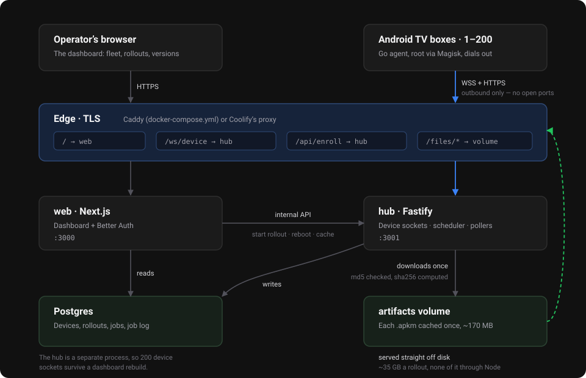

<div align="center">
  
  <h1>Magnemite</h1>
  <p><strong>Over-the-air updater for a fleet of rooted Android TV boxes.</strong></p>
  <p>
    It watches for new Pokémon GO <code>.apkm</code> releases, caches them once on your
    server, and installs them on 1 to 200 boxes from a dashboard. Supports per-device
    progress, automatic retries, canary rollouts and a hands-off mode.
  </p>
  <p>
    Built for boxes already running the Unown# stack (Dragonite / Golbat / Rotom).
  </p>
</div>

---

### Why “Magnemite”?

The scanning stack it plugs into names everything after Pokémon: Dragonite,
Golbat, Rotom, Koji, Poracle, so this one keeps the habit. Magnemite is the
magnet: it pulls new builds down once and sticks them onto every box. It is also
the Pokémon that only becomes interesting in numbers: three of them make a
Magneton, and this tool exists precisely because updating one box by hand is
fine and updating two hundred is not.

---

## Contents

- [What it does](#what-it-does)
- [How it fits together](#how-it-fits-together)
- [Two URLs, two audiences](#two-urls-two-audiences)
- [Where the APKs come from](#where-the-apks-come-from)
- [Quick start](#quick-start)
- [Enrollment tokens](#enrollment-tokens)
- [Putting the agent on a box](#putting-the-agent-on-a-box)
- [What an update actually does](#what-an-update-actually-does)
- [Rollouts](#rollouts)
- [Automatic updates](#automatic-updates)
- [Rotom](#rotom)
- [Accounts](#accounts)
- [Local development](#local-development)
- [Things that will bite you](#things-that-will-bite-you)
- [Security](#security)
- [Layout](#layout)

---

## What it does

|                           |                                                                            |
| ------------------------- | -------------------------------------------------------------------------- |
| **Watches two sources**   | GitHub releases and `mirror.unownhash.com`, polled on a schedule           |
| **Caches once**           | The server downloads each `.apkm` a single time and hashes it              |
| **Targets what you pick** | One box, a selection, a group, or the whole fleet                          |
| **Canary first**          | A few boxes update alone; a failure parks the rollout instead of spreading |
| **Real progress**         | Download percentage, install phase and the box's own log, per device       |
| **Retries by itself**     | Offline, stalled or failed jobs come back without anyone watching          |
| **Or fully automatic**    | New version → cached → rolled out inside your time window                  |
| **No open ports**         | Boxes dial out; nothing on the LAN needs exposing                          |

---

## How it fits together

<div align="center">
  
</div>

- **agent** — a ~6 MB static Go binary on each box, installed as a Magisk
  module. It dials **out** to the hub over WSS, so the boxes work behind any
  NAT, CGNAT or changing IP with no ports open and no VPN.
- **hub** — holds the device sockets, schedules jobs, polls both releases, and downloads each `.apkm` onto the server once.
- **web** — the dashboard. Reads Postgres directly; anything that touches a
  live socket goes through the hub's internal API.
- **edge** — Caddy. It fronts the hub and streams the cached bundles straight
  off the shared volume, so the ~35 GB of a fleet-wide rollout never passes
  through Node. In `docker-compose.yml` it also terminates TLS and serves the
  dashboard; in `docker-compose.coolify.yml` Coolify's proxy handles TLS and
  Caddy sits behind it, in front of the hub only.

The hub is a separate process from the dashboard on purpose: 200 device sockets
have to survive a dashboard rebuild.

---

## Two URLs, two audiences

Two different things talk to Magnemite, and it matters which URL each one gets.

| Audience              | What it needs                                         | Env var                   |
| --------------------- | ----------------------------------------------------- | ------------------------- |
| **You**, in a browser | The **dashboard** — login, fleet, rollouts            | `MAGNEMITE_DASHBOARD_URL` |
| **The boxes**         | The **hub** — `/ws/device`, `/api/enroll`, `/files/*` | `MAGNEMITE_PUBLIC_URL`    |

> [!IMPORTANT]
> Everywhere a box is configured — `SERVER=` when building the module,
> `serverUrl` in `config.json`, `-server` on the agent — the value is the
> **hub URL**, never the dashboard's. It is what `MAGNEMITE_PUBLIC_URL` is set
> to, and the agent builds its artifact download URLs from it.

**With Caddy** both live on one domain, so the two URLs are identical and
compose fills the dashboard one in for you. Set `MAGNEMITE_PUBLIC_URL` and
you are done.

**With Coolify** they are split across two domains — the dashboard on
`magnemite.example.com`, the hub on `agents.magnemite.example.com` — so the
boxes get the `agents.` one.

---

## Where the APKs come from

| Source                                | Index               | Notes                                                  |
| ------------------------------------- | ------------------- | ------------------------------------------------------ |
| `mirror.unownhash.com`                | `index.json`        | Publishes an md5 per file. Default source.             |
| `The-Treeline-Project/Silva-Releases` | GitHub releases API | No hash published, so the download is checked by size. |

Both ship `com.nianticlabs.pokemongo` as an arm64-v8a `.apkm`, which is a zip
holding `base.apk` plus `split_config.arm64_v8a.apk`. That is why installs go
through a `pm install-create` / `install-write` / `install-commit` session
rather than a plain `pm install`.

The hub computes a sha256 while caching, and that is what each agent verifies
before it opens an install session.

---

## Quick start

### With Caddy (a plain VPS)

```sh
git clone <this repo> magnemite && cd magnemite
cp .env.example .env
# Set MAGNEMITE_DOMAIN and MAGNEMITE_PUBLIC_URL, and generate the secrets:
#   openssl rand -base64 32
$EDITOR .env

docker compose up -d --build
docker compose exec hub pnpm --filter @magnemite/db run seed
```

The seed prints an **enrollment token** once — see below. Then sign in at your
domain with `ADMIN_EMAIL` / `ADMIN_PASSWORD`.

### With Coolify

`docker-compose.coolify.yml` lets Coolify's proxy terminate TLS and keeps a
small Caddy of our own (`edge`) in front of the hub — see
[Why there is still a Caddy on Coolify](#why-there-is-still-a-caddy-on-coolify).
It uses two domains rather than path routing:

| Coolify variable     | Points at                                                             |
| -------------------- | --------------------------------------------------------------------- |
| `SERVICE_FQDN_WEB`   | the dashboard you log into                                            |
| `SERVICE_FQDN_EDGE`  | what the boxes talk to — use a subdomain like `agents.<your-domain>` |

Deploy it as **New Resource → Docker Compose**, set both domains, then run the
seed once:

```sh
docker ps --format '{{.Names}}' | grep hub
docker exec -it <hub-container> pnpm --filter @magnemite/db run seed
```

Coolify generates the Postgres password, the internal secret, `AUTH_SECRET` and
the **admin password** itself, and shows them in the Environment tab. Read
`SERVICE_PASSWORD_ADMIN` from there to sign in the first time; change it from
Settings → Accounts afterwards if you prefer one you can remember.

The login defaults to `admin@magnemite.com`. Nothing is ever sent to it — the
address is an identifier, not a mailbox — so it only needs changing if you want
your own. Set `ADMIN_EMAIL` before the first seed if you do; changing it later
seeds a *second* admin rather than renaming the first, since the seed upserts on
the address.

> [!NOTE]
> There is no `.env` file inside the container, so the seed reads both values
> from the hub service's environment — which is why they are set on `hub` and
> not only on `web`.

> [!NOTE]
> The dashboard's own URL is read from `BETTER_AUTH_URL` /
> `MAGNEMITE_DASHBOARD_URL`, and falls back to the `SERVICE_FQDN_WEB` that
> Coolify injects. Coolify does not always have `SERVICE_URL_WEB` populated by
> the time Compose interpolates it, and Better Auth without a base URL derives
> the origin from the incoming Host header — which breaks callbacks behind the
> proxy. Nothing to set by hand; a bare host (no `https://`) is accepted too.

**Upgrading from an earlier version of this file.** The boxes' domain moved
from `SERVICE_FQDN_HUB_3001` to `SERVICE_FQDN_EDGE`. Keep the same domain
value and nothing needs re-flashing: a box only ever knows the URL.

#### Why there is still a Caddy on Coolify

Coolify's proxy (Traefik) routes; it does not serve files. It has no
`file_server` equivalent, and the `artifacts` volume belongs to this stack, not
to the Coolify-managed proxy container — so pointing the boxes' domain straight
at the hub means every one of those ~170 MB bundles is read and pushed by Node.

The `edge` service closes that gap. It mounts `artifacts` read-only, answers
`/files/*` with `file_server` (native `Range`, so an interrupted download
resumes) behind a `forward_auth` call to the hub's `/internal/authz`, and
proxies only `/ws/device`, `/api/enroll` and `/healthz` through. Everything else
on that domain is a 404, which keeps the hub's `/internal/*` API unreachable
from outside — the same guarantee the Caddy setup gives.

So `SERVE_ARTIFACTS` is `false` in both deployments, and Node stays out of the
data path either way.

---

## Enrollment tokens

A **device token** is per-box and secret: it is what a box authenticates every
socket and every download with. But a factory-fresh box has no token yet, and
you are not going to paste 200 of them by hand.

The **enrollment token** solves that. It is one shared secret that says _“a box
holding this is allowed to register itself”_. Flash the same one onto a whole
batch; each box trades it for a device token of its own on first boot.

```
box boots ─► POST /api/enroll { enrollmentToken, serial, model, … }
                    │
                    ▼
          hub creates the Device row
                    │
                    ▼
box receives ◄─ its own deviceToken   ─► and deletes the enrollment
                                          token from its config
```

**Where you get one**

- `pnpm db:seed` mints one on a fresh database and prints it **once**.
- Afterwards: **Settings → Enrollment tokens → New token**, also shown once.
  Only its sha256 is stored, so it cannot be recovered — mint another instead.

**What you can do with one**

- Cap it with **max uses** — a batch of 20 boxes can get a token good for 20.
- Turn **auto-approve** off, and enrolled boxes sit as _pending approval_ until
  you approve them; they receive no updates in the meantime.
- **Revoke** it at any time. Boxes already enrolled are unaffected: they have
  their own tokens now.

Lost yours? Mint a new one. There is nothing to recover, and nothing breaks.

---

## Putting the agent on a box

Build the Magisk module with the **hub URL** and an enrollment token baked in,
so flashing is the only step per box:

```sh
# SERVER is the hub URL — the same value as MAGNEMITE_PUBLIC_URL.
# Caddy setup:  https://magnemite.example.com
# Coolify:      https://agents.magnemite.example.com
make module SERVER=https://magnemite.example.com TOKEN=<enrollment token>
# → dist/magnemite-agent-0.1.2.zip
```

On Windows: `./scripts/build-agent.ps1 -Server https://… -Token <token>`

Install it through the Magisk app
```sh
adb push .\magnemite-agent-0.1.0.zip /data/local/tmp/magnemite-agent-0.1.0.zip; adb shell "su -c 'magisk --install-module /data/local/tmp/magnemite-agent-0.1.0.zip'"
```

Or in bulk over the LAN:

```sh
./scripts/enroll.sh dist/magnemite-agent-0.1.2.zip 192.168.1.10 192.168.1.11
./scripts/enroll.sh dist/magnemite-agent-0.1.2.zip -f hosts.txt
```

That is the only time a box needs hands-on work. After it reboots, every later
update rides the socket it opened itself — no adb, no LAN access.

Without a baked-in config, write `/data/adb/magnemite/config.json` on the box
before rebooting:

```json
{
  "serverUrl": "https://magnemite.example.com",
  "enrollmentToken": "…"
}
```

> `serverUrl` is the **hub** URL. Point a box at the dashboard's domain and it
> will fail the handshake on `/ws/device`.

---

## What an update actually does

1. Refuse to start unless `/data` has ~3× the bundle size free (172 MB unpacks
   to 250 MB, and both sit on disk at once).
2. Download the `.apkm` from your server with a `Range` header, so a box that
   drops its uplink at 80% resumes instead of starting over. Verify sha256.
3. Pick the splits that belong on this box — base plus the matching ABI, and
   the nearest density and language splits if the bundle has them.
4. Run the group's **pre-install hook** (usually stopping the scanner).
5. `pm install-create -r -d -i com.android.vending`, write each split, commit.
6. **If Android rejects the in-place upgrade** (different signing key, or a
   downgrade), uninstall and install clean. This wipes the app's data, so the
   job is flagged `data wiped` in the dashboard.
7. Verify with `dumpsys package` that the expected version is really installed.
8. Run the **post-install hook** (usually starting the scanner again).

Every step reports progress, so the dashboard shows a real percentage rather
than a spinner.

### In-place vs clean

The default preserves app data and only falls back to a wipe when Android
insists. Ticking **force a clean install** on a rollout uninstalls first on
every device — the dialog says so plainly, because on 200 boxes that is 200
logins gone.

---

## Rollouts

- **Canary + soak.** The first N devices update alone. The rest are held until
  those succeed, plus a soak period. A failed canary parks the rollout at
  `PAUSED` instead of pushing a bad build to the fleet.
- **Concurrency.** `MAX_CONCURRENT_JOBS` caps the whole fleet; a device group
  can set a lower cap for a site on a thin uplink.
- **Offline devices.** Their job stays queued and dispatches the moment the
  agent reconnects. Nothing to retry by hand.
- **Retries.** A failed job is re-queued automatically up to the rollout's
  attempt limit; the download already on disk makes the retry cheap. After
  that, `Retry` and `Retry all failed` are in the UI.
- **Stalled jobs.** A box unplugged mid-install stops sending progress; after
  `JOB_STALL_TIMEOUT` the hub re-queues the job.

---

## Automatic updates

Settings → Auto-update. When it is on, the hub:

1. polls both sources every `SOURCE_POLL_MINUTES`,
2. caches the newest **approved** version onto the server,
3. creates a rollout with your canary and soak settings,
4. dispatches only inside the time window, if you set one.

It never downgrades, never runs two rollouts for the same app at once, and does
nothing at all if every device is already on the newest version.

Leaving **approve new versions automatically** off means a human ticks approve
on the Versions page before anything moves — a reasonable default while you are
still learning to trust it.

---

## Rotom

Optional, and worth turning on. Set `ROTOM_ENABLED=true`, `ROTOM_URL`
(RotomNG's HTTP listener, usually `:7072`) and `ROTOM_SECRET`, and Rotom becomes
part of the update itself rather than a status widget:

1. **Before an install** the box is `disable`d in Rotom, so the controller stops
   handing it accounts instead of a scan dying mid-session.
2. **After it succeeds** the box is `enable`d and the scanner `restart`ed onto
   the new build — replacing the post-install hook you would otherwise write
   per group.
3. **The success signal** becomes the box reappearing in Rotom with live
   workers, not `pm` having printed Success. If it does not come back within
   five minutes, the job log says so.

If the hub restarts mid-install, the next scheduler tick re-enables any box it
had disabled for a job that is no longer running, so nothing is left parked out
of the pool.

Devices are matched to Rotom by `origin`, falling back to the serial and then to
an unambiguous public IP. The fleet table grows a **Scanner** column once at
least one box is matched, and the device page gains a **Restart scanner** button.

Built against the
[RotomNG HTTP API](https://github.com/UnownHash/RotomNG/blob/main/docs/RotomNG-API.md)
(`GET /api/device`, `PUT /api/device/{id}/action/{action}`, `X-Rotom-Secret`).

---

## Accounts

The dashboard uses [Better Auth](https://better-auth.com) with email and
password, backed by the same Postgres.

- **Sign-up is disabled.** Accounts are created from Settings → Accounts by an
  admin; the login page is not a way in for whoever finds it.
- **Roles.** `admin` (everything, including accounts), `operator` (rollouts and
  device control), `viewer` (read-only). The UI hides what a role cannot do and
  every server action re-checks it.
- **Passwords** are bcrypt, configured through Better Auth's hasher hooks, so
  `pnpm db:seed` can create the first admin without importing Better Auth into
  the database package. Re-running the seed resets `ADMIN_EMAIL`'s password —
  that is the way back in if you lose the login.
- Changing someone's password deletes their sessions, signing them out
  everywhere.
- `ADMIN_EMAIL` must be a well-formed address. `admin@localhost` is rejected.

### Light and dark

The dashboard follows the OS by default and can be pinned light or dark from the
sidebar. Dark is `#111111` for the page and `#222222` for anything raised off it.
Every colour is a CSS token, so no component carries a hard-coded one.

---

## Local development

```sh
pnpm install
docker compose up -d postgres
pnpm --filter @magnemite/db exec dotenv -e ../../.env -- prisma migrate dev
pnpm db:seed

pnpm --filter @magnemite/hub dev     # :3001
pnpm --filter @magnemite/web dev     # :3000
```

The dev `.env` sets `SERVE_ARTIFACTS=true` so the hub serves `/files/*` itself,
standing in for Caddy, and points `MAGNEMITE_PUBLIC_URL` straight at `:3001`.
Leave `SERVE_ARTIFACTS` **off** in either deployment: both put Caddy in front
of `/files/*`.

### Testing without hardware

The agent's `-fake-root` mode stubs out `pm`, `dumpsys` and `getprop` and
nothing else — the download, the sha256 check and the `.apkm` extraction are all
real. So a fake fleet exercises the actual pipeline:

```sh
make agent
./scripts/fake-fleet.sh 200 <enrollment-token>
# Windows: ./scripts/build-agent.ps1; ./scripts/fake-fleet.ps1 -Count 200 -Token <token>
```

Failure injection lives in `agent/internal/sys/fake.go`:

| Variable                           | Effect                                                         |
| ---------------------------------- | -------------------------------------------------------------- |
| `MAGNEMITE_FAKE_COMMIT_ERROR`      | text `install-commit` fails with                               |
| `MAGNEMITE_FAKE_COMMIT_ERROR_ONCE` | fail only the first commit, to exercise the uninstall fallback |
| `MAGNEMITE_FAKE_FREE_BYTES`        | override free space, to trip the space gate                    |
| `MAGNEMITE_FAKE_INSTALL_MS`        | how long a commit pretends to take                             |

---

## Things that will bite you

### DNS on Android

**Symptom.** The agent logs `lookup magnemite.example.com: no such host` and
never connects, while the box itself browses the web perfectly and `ping` from
`adb shell` resolves the same name without trouble.

**Why.** The agent is built with `CGO_ENABLED=0` so it is one static binary that
needs no NDK to cross-compile and no shared libraries on the box. The cost is
that Go stops calling the system resolver and uses its own, written in Go — and
that resolver learns which nameservers to use by reading `/etc/resolv.conf`.

Android does not have that file. Bionic, Android's libc, asks the `netd` daemon
over a socket instead, and publishes the current servers as system properties.
So everything on the box resolves names except a CGO-free Go program, which
finds no config, has no servers to ask, and fails every lookup.

**The fix** (`agent/internal/netfix`). At startup the agent checks for
`/etc/resolv.conf`. If it is missing it installs a `net.Resolver` whose dialer
targets the servers from `getprop net.dns1` … `net.dns4`, with `1.1.1.1` and
`8.8.8.8` behind them, and rotates to the next one whenever a server refuses a
connection — common on a LAN where the router's resolver black-holes.

**Consequences worth knowing.** On a box whose DNS is genuinely broken you can
set `serverUrl` to a bare IP and skip resolution entirely. And if you ever
rebuild the agent with CGO enabled, this code becomes dead weight — but so does
the single-binary cross-compile.

### Small `/data`

Boxes need roughly 450 MB free. The fleet table shows free space per device and
warns under 500 MB, so you can see the problem before a rollout instead of
during one.

### Egress

A full rollout to 200 boxes is ~35 GB off your server. `MAX_CONCURRENT_JOBS`
paces it; check your traffic allowance before the first fleet-wide update.

---

## Security

- Each device gets its own bearer token; only its sha256 is stored. Artifact
  downloads are gated on it — through Caddy's `forward_auth`, or the hub's own
  check when it serves the files.
- The enrollment token is dropped from the box's config once it has traded it
  for a device token, so a stolen box cannot enroll more devices.
- Enrollment tokens can be limited by use count and revoked from Settings.
- Dashboard sessions are Better Auth cookies signed with `AUTH_SECRET`, and the
  request origin is checked against `MAGNEMITE_DASHBOARD_URL`.
- The hub's `/internal/*` API is reachable only from the web container, behind
  `HUB_INTERNAL_SECRET`, and the proxy never routes to it from outside.
- The agent runs as root but **changes no device settings**. It installs, reads
  package versions and free space, and runs the hooks you configured: nothing
  else. In particular it never weakens Play Protect or any other verifier to
  make an install succeed.

---

## Layout

```
apps/hub          Fastify: device sockets, scheduler, source pollers, artifact cache
apps/web          Next.js dashboard
packages/db       Prisma schema + client
packages/protocol Wire protocol shared by hub and dashboard (mirrored in Go)
agent             The Go agent
magisk-module     Module that starts the agent as root at boot
scripts           Bulk provisioning, fake fleet, builds
docs              Diagrams
```
