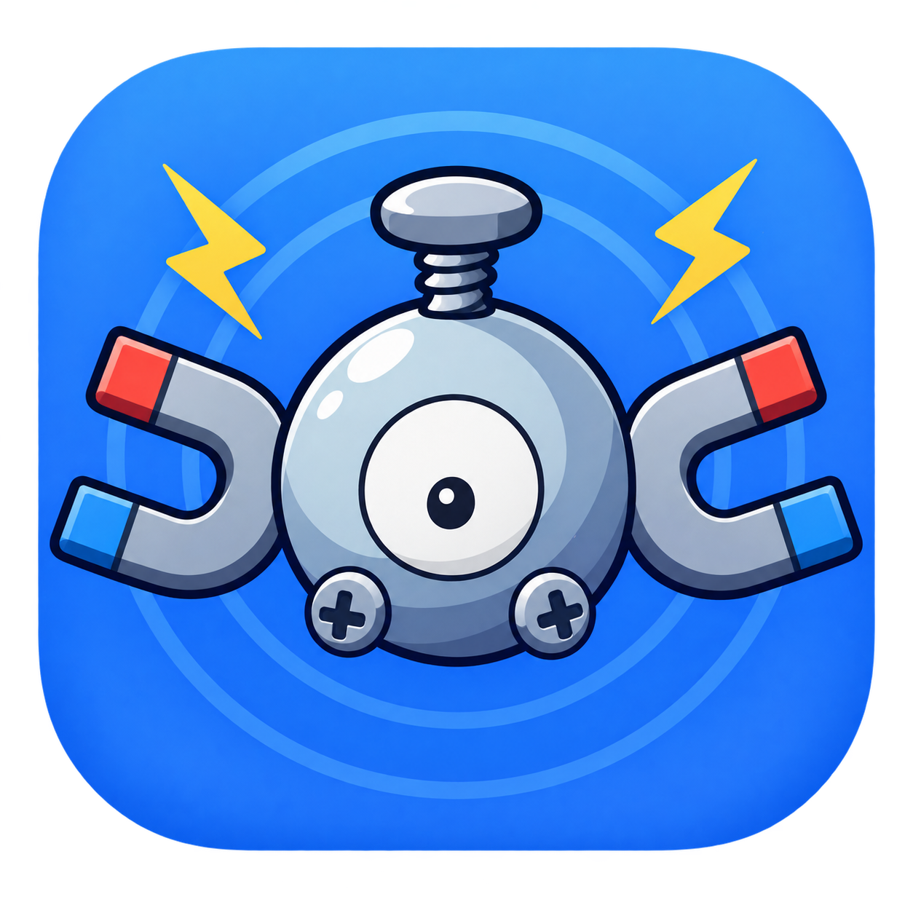

<div align="center">
  
  <h1>Magnemite</h1>
  <p><strong>Over-the-air updater for a fleet of rooted Android TV boxes.</strong></p>
  <p>
    It watches for new Pokémon GO <code>.apkm</code> releases, caches them once on your
    server, and installs them on one box or a whole fleet from a dashboard. Supports per-device
    progress, automatic retries, canary rollouts and a hands-off mode.
  </p>
  <p>
    Built for boxes already running the Unown# stack.
  </p>
  <p>
    <a href="https://magnemite.chung-jf.me">
      
    </a>
  </p>
</div>

---

### Why “Magnemite”?

The scanning stack it plugs into names everything after Pokémon: Dragonite,
Golbat, Rotom, Koji, Poracle, so this one keeps the habit. Magnemite is the
magnet: it pulls new builds down once and sticks them onto every box. It is also
the Pokémon that only becomes interesting in numbers: three of them make a
Magneton, and this tool exists precisely because updating one box by hand is
fine and updating two hundred is not.

## Architecture

Monorepo (pnpm workspaces):

```
apps/
  hub/            Fastify server — device enrollment, WebSocket control, job orchestration
  web/            Next.js dashboard — fleet view, rollouts, settings
  docs/           Documentation site (Fumadocs)
packages/
  db/             Prisma schema + client, shared by hub and web
  protocol/       Shared types/contracts between hub and devices
agent/            Go agent that runs on each box, talks to the hub over WebSocket
magisk-module/    Magisk module that installs and launches the agent on the box
scripts/          Build, enrollment and local fleet-simulation scripts
data/             Local runtime data (cached APK artifacts, etc.)
deploy/           Docker Compose stacks, Caddy edge config
```

Devices connect to the hub over a persistent WebSocket, register, and receive
install/update jobs. The web dashboard talks to the hub over HTTP/internal
routes and reads the same database for fleet state.

## Features & Services

- 📡 **Source feeds** — watches upstream sources for new Pokémon GO releases
  and caches them once on the server; add as many sources as you need.
- 📦 **Manual installs** — upload and push an APK by hand, outside any source
  feed or rollout.
- 🖥️ **Fleet management** — enroll devices, group them, and see live status
  for the whole fleet at a glance.
- 🚀 **Rollouts** — roll a new version out gradually (canary-style), with
  per-device progress and automatic retries.
- ⚙️ **Auto-update or manual mode** — choose per-device or fleet-wide between
  hands-off auto-updates and manual approval.
- 🧾 **Jobs & events** — full history of install/update jobs and what
  happened on each device.
- 👀 **Watched packages** — keep an eye on any extra app installed on a
  device, not just the main one.
- 📊 **Device detail dashboard** — a page per device with monitoring stats,
  installed packages, hardware info and current state.
- 🎮 **Remote actions & commands** — run commands on a device straight from
  the dashboard, including a **reboot**.
- 📜 **Live logs & logcat download** — watch a device's logs stream in real
  time, or download the full bundle as `logcat.zip`.
- 🔄 **Agent auto-update** — the on-device agent keeps itself up to date too.
- ❤️ **Health & scheduling** — periodic health checks and scheduled jobs keep
  the fleet honest.
- 🔐 **Auth & audit** — accounts, sessions, and an audit log of admin
  actions.
